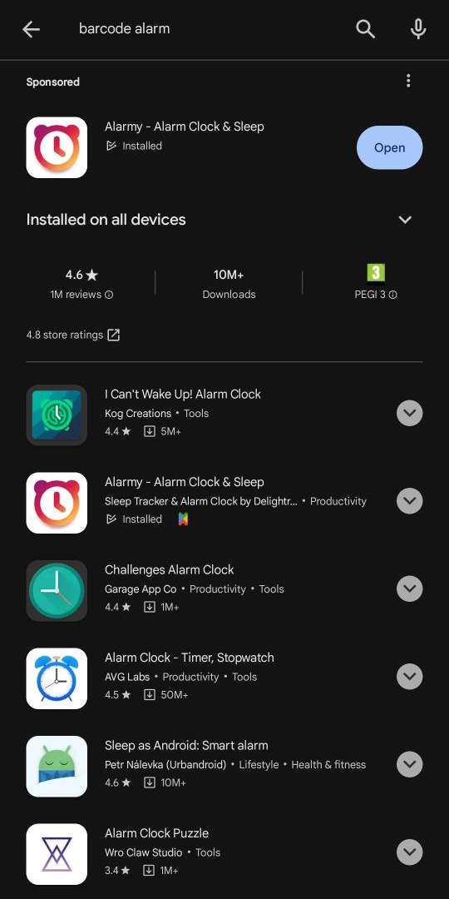

# Barcode alarm productivity
Make better use of barcode alarms and literally force yourself to do something productive :)

## The idea behind
There are many alarm apps with the barcode-scanning functionality: the alarm won't turn off, until you scan a specific barcode.

### 

Of course, having to walk to another room - to scan the barcode - might be sufficient to wake yourself up. However, it rather won't force you to start doing a specific activity. 
 

### Unless...
**...unless the barcode won't show up until you actually start doing it! ;)**

 

## Coding
Thanks to the script below, the barcode is generated when Python detects that you've been coding for some time.

### [check-if-coding.py](check-if-coding.py)

How it works: it reads what you're typing on your keyboard, and counts how many times programming-specific keys were clicked.
~~~python
programming_chars = {'{', '}', '(', ')', '=', '.', '<', '>', ';', 'space', 'shift', 'tab', 'ctrl', 'tab', 'enter'}
~~~

Once they've been clicked enough times, it creates an image file with barcode, opens it and delets it right after _(so that you won't be cheating)_.

 

## Meditation
If you wish to start practicing mindfulness but you find it difficult, then this might be helpful for you.

### [barcode-after-meditation.html](barcode-after-meditation.html)

This webpage contains a sound player - you need to have your own file, named: *Meditation.mp3*, located in the same folder.
~~~html
<audio controls autoplay>
  <source src="Meditation.mp3" type="audio/mp3">
</audio>
~~~

After playing the audio for a certain time (in this example: a little more than 6 minutes), the barcode will show up - assuming you've been meditating during this time.
~~~html
var time = 1000 * (60*6 + 20); // 1000 ms = 1 seconds
~~~
